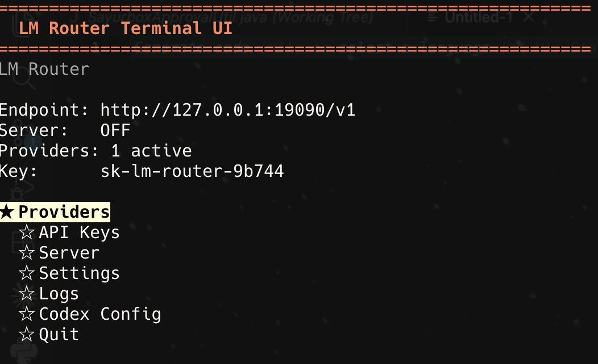

# LM Router

`lm-router` turns multiple OpenAI Codex and Anthropic Claude subscription OAuth connections into one local API endpoint.

It provides model-prefix routing, provider-scoped priority and failover, local API-key authentication, a terminal UI, and SQLite persistence.

> [!WARNING]
> Claude subscriptions and the Anthropic API are separate products. Routing Claude subscription OAuth through a third-party router is not an officially licensed Anthropic API flow, may violate provider terms, and may put the connected account at risk. Automatic fallback across subscriptions can be viewed as combining or bypassing account capacity limits; it does not guarantee protection from provider restrictions. You must explicitly accept this risk before connecting an Anthropic Claude account.

## Features

- OpenAI-compatible endpoints: `POST /v1/responses`, `POST /v1/chat/completions`, `GET /v1/models`
- Anthropic-compatible `POST /v1/messages` and `POST /v1/messages/count_tokens`, including streaming, thinking, tools, prompt caching, and Claude Code headers
- Multiple Codex and Claude connections with provider-scoped priority and failover on retryable errors (`429`, upstream `5xx`)
- Custom OpenAI/Anthropic-compatible connections routed by model prefix, authenticated with a static API key
- Provider-specific OAuth refresh, account testing, and quota display
- CLI and terminal UI for providers, API keys, settings, and logs; sensitive headers are redacted from logs

## Requirements

- Go 1.25+
- A browser for OAuth
- At least one supported Codex or Claude account

## Quick Start

Add a Codex account:

```bash
go run ./cmd/lm-router auth add openai-codex --name main --test
```

Open the printed OAuth URL, authorize the account, and paste the callback URL into the terminal.

To add a Claude connection, read the warning above and run:

```bash
go run ./cmd/lm-router auth add anthropic-claude --name main
```

The CLI accepts `claude` as an input alias but stores `anthropic-claude`. Type the risk confirmation when prompted, then paste either the callback URL or the `code#state` value. For explicitly approved non-interactive use, pass `--accept-risk`. The OAuth URL is saved to `~/.lm-router/anthropic-claude-auth-url.txt`.

Create a local API key:

```bash
go run ./cmd/lm-router keys create --name local
```

Save the printed `Secret`. This key authenticates clients to `lm-router`; it is not an OpenAI API key.

Start the proxy:

```bash
go run ./cmd/lm-router serve --host 127.0.0.1 --port 19090
```

Verify it:

```bash
curl http://127.0.0.1:19090/health
```

## Use with Codex CLI

Keep `lm-router` running, then export the local key:

```bash
export LM_ROUTER_API_KEY="sk-lm-router-REPLACE_ME"
```

Add the provider to the user-level `~/.codex/config.toml`. Merge it with any existing configuration:

```toml
model = "gpt-5.3-codex"
model_provider = "lm-router"

[model_providers.lm-router]
name = "LM Router"
base_url = "http://127.0.0.1:19090/v1"
env_key = "LM_ROUTER_API_KEY"
wire_api = "responses"
```

Use the user-level file: Codex ignores `model_provider` and `model_providers` in project-level `.codex/config.toml` files. See the [Codex configuration reference](https://developers.openai.com/codex/config-reference/).

Using `env_key` keeps the router key separate from `~/.codex/auth.json`, preserving any existing Codex login.

Test the authenticated endpoint:

```bash
curl \
  -H "Authorization: Bearer $LM_ROUTER_API_KEY" \
  http://127.0.0.1:19090/v1/models
```

Start a new Codex session:

```bash
codex
```

## Use with Claude Code

Keep the router running and set Claude Code to the local endpoint:

```bash
export ANTHROPIC_BASE_URL="http://127.0.0.1:19090"
export ANTHROPIC_AUTH_TOKEN="sk-lm-router-REPLACE_ME"
# Optional; it must retain the claude prefix:
export ANTHROPIC_MODEL="claude-sonnet-4-6"

claude
```

You can print the same environment configuration without modifying user files:

```bash
go run ./cmd/lm-router claude print-config \
  --port 19090 \
  --api-key sk-lm-router-REPLACE_ME \
  --model claude-sonnet-4-6
```

`ANTHROPIC_AUTH_TOKEN` is the local `lm-router` API key, not the upstream OAuth token. The router replaces it with the selected provider token and never forwards the local key upstream.

## Custom Providers

Route a model prefix to any OpenAI-compatible or Anthropic-compatible HTTP endpoint using a static API key instead of OAuth:

```bash
go run ./cmd/lm-router auth add custom \
  --name my-server --prefix myapi --base-url https://api.example.com/v1 \
  --compat-type openai-compatible --api-type chat
# prompts for the API key without echoing it
```

A request for model `myapi/gpt-4o` then routes to that connection, with the prefix stripped before forwarding. `--api-type` (`chat` or `responses`) only applies to `openai-compatible`; anthropic-compatible connections serve `/v1/messages`. Edit a saved connection with `auth edit <account-id> [--name] [--prefix] [--base-url] [--api-key] [--api-type]` (omit `--api-key` to keep the current one), or manage it from the TUI under `Providers > Custom Provider`.

Custom connections are passthrough only: no format translation and no multi-key failover — one prefix maps to exactly one connection. See [Model Routing](#model-routing-failover-and-quota) below for the endpoint matrix.

## Client URLs

| Client | Base URL | API |
| --- | --- | --- |
| Codex CLI | `http://127.0.0.1:19090/v1` | Responses |
| OpenAI SDK | `http://127.0.0.1:19090/v1` | Responses or Chat Completions |
| Anthropic SDK | `http://127.0.0.1:19090` | Messages |

The Anthropic SDK base URL must not include `/v1`; the SDK appends the Messages path itself.

Example with the OpenAI Python SDK:

```python
from openai import OpenAI

client = OpenAI(
    base_url="http://127.0.0.1:19090/v1",
    api_key="sk-lm-router-REPLACE_ME",
)

response = client.responses.create(
    model="gpt-5.3-codex",
    input="Write a hello world program in Go.",
)
print(response.output_text)
```

## Terminal UI

```bash
go run ./cmd/lm-router tui
```



Optional:

```bash
go run ./cmd/lm-router tui \
  --data-dir ~/.lm-router \
  --host 127.0.0.1 \
  --port 19090
```

The TUI starts with `Providers > OpenAI Codex`, `Providers > Anthropic Claude`, or `Providers > Custom Provider`, then shows only that type's connections. Codex and Claude connections support alias editing, connection tests, quota, refresh, re-authentication, enable/disable, deletion, and Shift+Up/Down reordering; custom connections support edit, test, enable/disable, and deletion (no quota, refresh, or OAuth). Claude OAuth is gated by a risk confirmation page. The home screen includes read-only Codex and Claude configuration views.

Long OAuth URLs are saved to `~/.lm-router/openai-codex-auth-url.txt` or `~/.lm-router/anthropic-claude-auth-url.txt` to avoid terminal clipping.

## CLI Reference

```bash
# General
go run ./cmd/lm-router version
go run ./cmd/lm-router serve
go run ./cmd/lm-router tui

# Providers
go run ./cmd/lm-router auth add openai-codex --name main
go run ./cmd/lm-router auth add anthropic-claude --name main
go run ./cmd/lm-router auth add claude --name backup --accept-risk
go run ./cmd/lm-router auth list
go run ./cmd/lm-router auth list --provider anthropic-claude
go run ./cmd/lm-router auth test --provider openai-codex --name main
go run ./cmd/lm-router auth test --provider anthropic-claude --name main
go run ./cmd/lm-router auth refresh <account-id>
go run ./cmd/lm-router auth refresh --provider anthropic-claude --name main
go run ./cmd/lm-router auth enable <account-id>
go run ./cmd/lm-router auth disable <account-id>
go run ./cmd/lm-router auth move <account-id> --priority 1
go run ./cmd/lm-router auth remove <account-id>

# Custom providers
go run ./cmd/lm-router auth add custom --name my-server --prefix myapi \
  --base-url https://api.example.com/v1 --compat-type openai-compatible --api-type chat
go run ./cmd/lm-router auth edit <account-id> --base-url https://api.example.com/v2

# API keys
go run ./cmd/lm-router keys create --name local
go run ./cmd/lm-router keys list
go run ./cmd/lm-router keys revoke <key-id>

# Codex config helper
go run ./cmd/lm-router codex print-config \
  --port 19090 \
  --api-key sk-lm-router-REPLACE_ME

# Claude Code config helper
go run ./cmd/lm-router claude print-config \
  --port 19090 \
  --api-key sk-lm-router-REPLACE_ME \
  --model claude-sonnet-4-6
```

The config helper prints authentication material; treat its output as sensitive. Prefer the environment-variable setup above if you want to preserve an existing Codex login.

## Model Routing, Failover, and Quota

Routing uses the trimmed model prefix case-insensitively. A model containing a `/` (`<prefix>/<model_id>`) is matched against registered custom-provider connections instead:

| Endpoint | `gpt*` | `claude*` | Matching custom prefix | Other prefix |
| --- | --- | --- | --- | --- |
| `/v1/messages` | Translate to Codex Responses | Native Anthropic Messages | Native passthrough (anthropic-compatible only) | `400` |
| `/v1/messages/count_tokens` | Local estimate | Native Anthropic token count | Local estimate (anthropic-compatible only) | `400` |
| `/v1/responses` | Codex Responses | `400`; use `/v1/messages` | Native passthrough (openai-compatible + responses only) | `400` |
| `/v1/chat/completions` | Translate to Codex Responses | `400`; use `/v1/messages` | Native passthrough (openai-compatible + chat only) | `400` |

`/v1/models` returns a static, informational list; it does not enumerate custom-provider models, and any `claude*` model is passed through without needing a router update.

For each request, the router tries enabled connections in priority order within the selected provider. Network errors, `429`, `5xx`, and persistent `401/403` after one refresh-and-retry can move to the next connection. Other `4xx` request errors stop immediately. `Retry-After` and rate-limit reset headers create per-account cooldowns; without them the router uses jittered exponential backoff from two seconds up to five minutes. A successful Claude fallback is promoted by atomically swapping its priority with the first failed connection; token-count calls never reorder connections. Once a successful streaming response starts, the router never switches accounts mid-stream.

Retrying a network failure can duplicate a request if Anthropic accepted it before the connection failed. Automatic rotation also combines the capacity of multiple subscriptions and does not prevent account limitations or other provider action.

Claude connection tests and quota views call the OAuth usage endpoint without sending an inference prompt. They display the five-hour, weekly, and model-specific weekly windows returned by Anthropic. A quota `429` still counts as connected and does not block inference; the TUI waits three minutes before polling quota again, using state separate from inference cooldowns.

## Local Data

State is stored under `~/.lm-router/` by default:

- `lm-router.db`
- `openai-codex-auth-url.txt`
- `anthropic-claude-auth-url.txt`
- SQLite `-wal` and `-shm` sidecar files when active

Treat this directory as sensitive because it contains local account credentials.

## Development

```bash
go test ./...
go build ./cmd/lm-router
go run ./cmd/lm-router version
```

GitHub Actions builds Linux `amd64` and `arm64` artifacts on pushes to `main` and manual workflow runs.

The project is local-first and does not currently include a web dashboard, Docker packaging, or cloud tunneling.

## License

Licensed under the [MIT License](./LICENSE).
