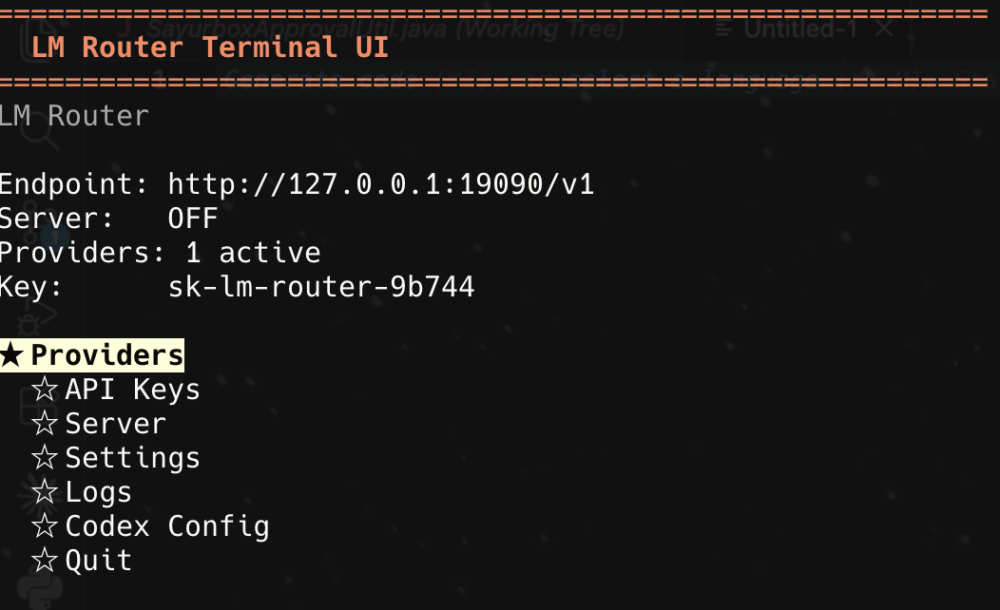

# LM Router

`lm-router` combines multiple OpenAI Codex and Anthropic Claude subscription OAuth connections behind one local API endpoint. It provides model-prefix routing, provider-scoped failover, local API-key authentication, CLI/TUI/desktop interfaces, and SQLite persistence.

> [!WARNING]
> Claude subscriptions and the Anthropic API are separate products. Routing Claude subscription OAuth through a third-party router may violate provider terms and put connected accounts at risk. Automatic fallback can also be viewed as combining account capacity. You must explicitly accept this risk before connecting a Claude account.

## Features

- OpenAI-compatible `/v1/responses`, `/v1/chat/completions`, and `/v1/models`
- Anthropic-compatible `/v1/messages` and `/v1/messages/count_tokens`
- Streaming, multimodal input, thinking, tools, prompt caching, and Claude Code headers
- Multiple Codex and Claude connections with priority, refresh, retry, quota, and failover
- Custom OpenAI/Anthropic-compatible providers selected by model prefix
- Local API keys, redacted logs, SQLite storage, TUI, and Wails desktop app

## Requirements

- Go 1.25+
- A browser for OAuth
- At least one supported Codex or Claude account

Desktop-specific requirements are listed under [Desktop App](#desktop-app).

## Quick Start

Add a Codex connection:

```bash
go run ./cmd/lm-router auth add openai-codex --name main --test
```

Open the printed OAuth URL, authorize the account, and paste the callback URL. To add Claude instead, acknowledge the warning above and run:

```bash
go run ./cmd/lm-router auth add anthropic-claude --name main
```

The CLI accepts `claude` as an alias but stores `anthropic-claude`. For approved non-interactive use, add `--accept-risk`.

Create a client API key and save the printed secret:

```bash
go run ./cmd/lm-router keys create --name local
```

Start and verify the proxy:

```bash
go run ./cmd/lm-router serve --host 127.0.0.1 --port 19090
curl http://127.0.0.1:19090/health
```

The `sk-lm-router-...` secret authenticates clients to LM Router; it is not an upstream provider key.

## Client Setup

### Codex CLI

Export the local key:

```bash
export LM_ROUTER_API_KEY="sk-lm-router-REPLACE_ME"
```

Merge the following into the user-level `~/.codex/config.toml`:

```toml
model = "gpt-5.3-codex"
model_provider = "lm-router"
web_search = "live"

[model_providers.lm-router]
name = "LM Router"
base_url = "http://127.0.0.1:19090/v1"
env_key = "LM_ROUTER_API_KEY"
wire_api = "responses"
http_headers = { "X-LM-Router-Codex-Mode" = "full", "X-LM-Router-Web-Search" = "live" }
```

Codex ignores provider configuration in project-level `.codex/config.toml` files. Using `env_key` also preserves an existing Codex login in `~/.codex/auth.json`. See the [Codex configuration reference](https://developers.openai.com/codex/config-reference/).

`X-LM-Router-Codex-Mode = "full"` preserves Responses input parts, tools, includes, and annotations that Codex normally removes for custom providers. `X-LM-Router-Web-Search` restores native web search: use `live`, `cached`, or `disabled`, and keep the top-level `web_search` value aligned with it. These headers are opt-in and do not affect other clients.

Test authentication, then start Codex:

```bash
curl -H "Authorization: Bearer $LM_ROUTER_API_KEY" \
  http://127.0.0.1:19090/v1/models
codex
```

### Hermes Agent

Hermes works best through the Responses API. Export `LM_ROUTER_API_KEY`, then add this provider to `~/.hermes/config.yaml`:

```yaml
providers:
  lm-router:
    name: LM Router
    base_url: http://127.0.0.1:19090/v1
    key_env: LM_ROUTER_API_KEY
    api_mode: codex_responses
    default_model: gpt-5.3-codex
    extra_headers:
      X-LM-Router-Codex-Mode: full

model:
  default: gpt-5.3-codex
  provider: custom:lm-router
  base_url: http://127.0.0.1:19090/v1
  api_mode: codex_responses
```

Responses mode preserves function calls and multimodal input directly. Hermes can also use `api_mode: chat_completions`; LM Router converts streamed function calls into standard `delta.tool_calls` chunks so tools such as `vision_analyze` execute instead of appearing as raw JSON.

### Claude Code

```bash
export ANTHROPIC_BASE_URL="http://127.0.0.1:19090"
export ANTHROPIC_AUTH_TOKEN="sk-lm-router-REPLACE_ME"
# Optional; retain the claude prefix:
export ANTHROPIC_MODEL="claude-sonnet-4-6"
claude
```

`ANTHROPIC_AUTH_TOKEN` is the local LM Router key. The router replaces it with the selected provider token and never forwards the local key upstream.

### SDK Base URLs

| Client | Base URL | API |
| --- | --- | --- |
| Codex CLI | `http://127.0.0.1:19090/v1` | Responses |
| OpenAI SDK | `http://127.0.0.1:19090/v1` | Responses or Chat Completions |
| Anthropic SDK | `http://127.0.0.1:19090` | Messages |

The Anthropic SDK base URL must omit `/v1` because the SDK appends the Messages path.

```python
from openai import OpenAI

client = OpenAI(
    base_url="http://127.0.0.1:19090/v1",
    api_key="sk-lm-router-REPLACE_ME",
)

response = client.responses.create(
    model="gpt-5.3-codex",
    input="Write a hello world program in Go.",
)
print(response.output_text)
```

## Custom Providers

Route `<prefix>/<model>` to a static-key OpenAI- or Anthropic-compatible endpoint:

```bash
go run ./cmd/lm-router auth add custom \
  --name my-server \
  --prefix myapi \
  --base-url https://api.example.com/v1 \
  --compat-type openai-compatible \
  --api-type chat
```

The command prompts for the API key without echoing it. A request for `myapi/gpt-4o` selects this connection and forwards `gpt-4o` upstream. `--api-type` (`chat` or `responses`) applies only to OpenAI-compatible providers; Anthropic-compatible providers serve `/v1/messages`.

Custom providers are passthrough-only: there is no format translation or multi-key failover, and one prefix maps to one connection.

## Terminal UI

```bash
go run ./cmd/lm-router tui
```



Optional overrides:

```bash
go run ./cmd/lm-router tui \
  --data-dir ~/.lm-router \
  --host 127.0.0.1 \
  --port 19090
```

The TUI manages Codex, Claude, and custom connections; priorities; tests; quota; refresh/re-auth; API keys; settings; and client configuration. Long OAuth URLs are also written to `~/.lm-router/openai-codex-auth-url.txt` or `~/.lm-router/anthropic-claude-auth-url.txt`.

## Desktop App

The Wails desktop app uses the same SQLite data and application services as the CLI/TUI. It manages connections, keys, settings, logs, OAuth, and its own in-process proxy.

Requirements:

- Wails v3.0.0-beta.16
- Node.js 22+ and npm
- macOS: Xcode command-line tools
- Linux: GTK 3 and WebKitGTK 4.1 development packages

Install Wails if needed:

```bash
go install github.com/wailsapp/wails/v3/cmd/wails3@v3.0.0-beta.16
```

Run with hot reload:

```bash
make desktop-dev
```

Development runs as `LM Router Dev` with `~/.lm-router-dev` and port `19091`. The packaged app uses `~/.lm-router` and port `19090`, so both can run simultaneously. Override the development profile when needed:

```bash
make desktop-dev DESKTOP_DEV_DATA_DIR=/tmp/lm-router-dev DESKTOP_DEV_PORT=19191
```

Build a local application:

```bash
make desktop-mac
# On a Linux build host:
make desktop-linux
```

The macOS bundle is written to:

```text
desktop/build/bin/LM Router.app
```

Open it with:

```bash
open "desktop/build/bin/LM Router.app"
```

The shared Vue/TypeScript frontend lives in `frontend/`; `npm run build` writes the independent web assets to `frontend/dist` before they are embedded into the desktop binary.

### Tray Menu

The application creates a native tray/menu-bar item on macOS, Windows, and supported Linux desktop environments. Its menu provides:

- `Open`
- Server status and `Endpoint ip:port`
- Start/stop server
- Copy endpoint
- `Quit`

**Settings > Enable tray menu** controls whether the item is shown and defaults to enabled. With the tray enabled, closing the main window hides it while the proxy continues running. With the tray disabled, closing the window exits the application so it cannot remain inaccessible in the background.

The setting applies immediately on macOS and Windows. Wails v3.0.0-beta.16 cannot hide an already-running Linux tray item, so Linux applies the disabled state after the application restarts. Linux also requires a desktop environment with StatusNotifier/AppIndicator support, such as the standard Ubuntu Desktop configuration.

If the configured endpoint already responds to `/health`, the desktop app reports a port conflict instead of taking it over. Codex OAuth returns through loopback port `1455` when available; Claude uses its copy-and-paste callback flow.

Desktop files use the `wailsapp` build tag, so CLI-only builds and tests do not require desktop dependencies.

## CLI Reference

```bash
# General
go run ./cmd/lm-router version
go run ./cmd/lm-router serve
go run ./cmd/lm-router tui

# Connections
go run ./cmd/lm-router auth add openai-codex --name main
go run ./cmd/lm-router auth add anthropic-claude --name main
go run ./cmd/lm-router auth list
go run ./cmd/lm-router auth test --provider openai-codex --name main
go run ./cmd/lm-router auth refresh <account-id>
go run ./cmd/lm-router auth enable <account-id>
go run ./cmd/lm-router auth disable <account-id>
go run ./cmd/lm-router auth move <account-id> --priority 1
go run ./cmd/lm-router auth remove <account-id>
go run ./cmd/lm-router auth edit <account-id> --base-url https://api.example.com/v2

# API keys
go run ./cmd/lm-router keys create --name local
go run ./cmd/lm-router keys list
go run ./cmd/lm-router keys revoke <key-id>

# Client config helpers
go run ./cmd/lm-router codex print-config \
  --port 19090 --api-key sk-lm-router-REPLACE_ME
go run ./cmd/lm-router claude print-config \
  --port 19090 --api-key sk-lm-router-REPLACE_ME --model claude-sonnet-4-6
```

Config helpers print authentication material; treat their output as sensitive.

## Routing, Failover, and Quota

Routing matches the model prefix case-insensitively. `<prefix>/<model>` selects a registered custom provider.

| Endpoint | `gpt*` | `claude*` | Custom prefix | Other |
| --- | --- | --- | --- | --- |
| `/v1/messages` | Translate to Responses | Native Messages | Anthropic passthrough | `400` |
| `/v1/messages/count_tokens` | Local estimate | Native token count | Local estimate | `400` |
| `/v1/responses` | Native Responses | `400` | OpenAI Responses passthrough | `400` |
| `/v1/chat/completions` | Translate to Responses | `400` | OpenAI Chat passthrough | `400` |

Enabled connections are tried in provider-scoped priority order. Network errors, `429`, upstream `5xx`, and persistent `401/403` after one refresh may fail over; other `4xx` responses stop immediately. `Retry-After` and rate-limit headers create per-account cooldowns, otherwise jittered exponential backoff ranges from two seconds to five minutes.

A successful Claude fallback swaps priority with the first failed connection. Token-count calls never reorder connections, and streaming responses never switch accounts after output begins. Retrying network failures can duplicate a request if the provider accepted it before the connection failed.

Claude quota views show the five-hour, weekly, and model-specific windows returned by Anthropic. A quota `429` does not block inference and uses cooldown state separate from routing failures.

## Local Data

State is stored under `~/.lm-router/` by default:

- `lm-router.db`
- OAuth URL text files
- Active SQLite `-wal` and `-shm` files

Treat this directory as sensitive because it contains local account credentials. Development desktop data is isolated under `~/.lm-router-dev/`.

## Development

```bash
go test ./...
go build ./cmd/lm-router
go run ./cmd/lm-router version
```

GitHub Actions builds Linux `amd64` and `arm64` CLI artifacts on pushes to `main` and manual workflow runs. The project is local-first and does not include Docker packaging, a hosted dashboard, or built-in cloud tunneling.

## License

Licensed under the [MIT License](./LICENSE).
